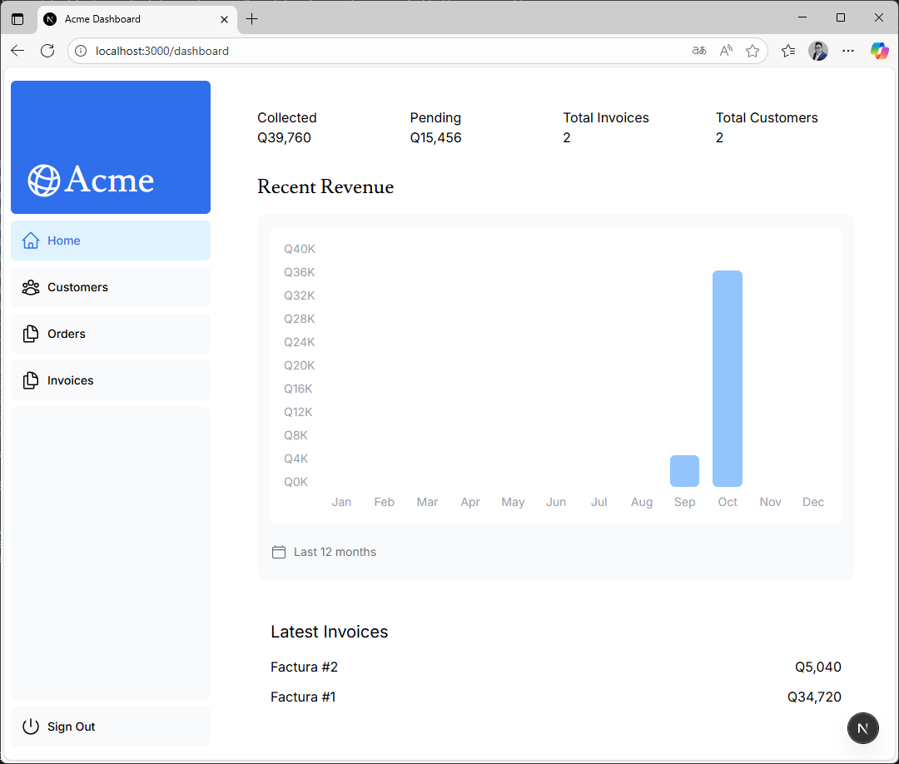
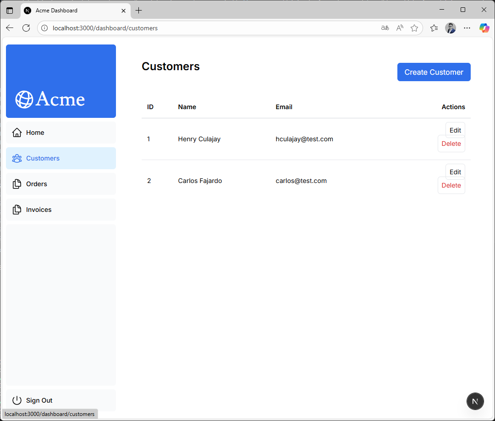
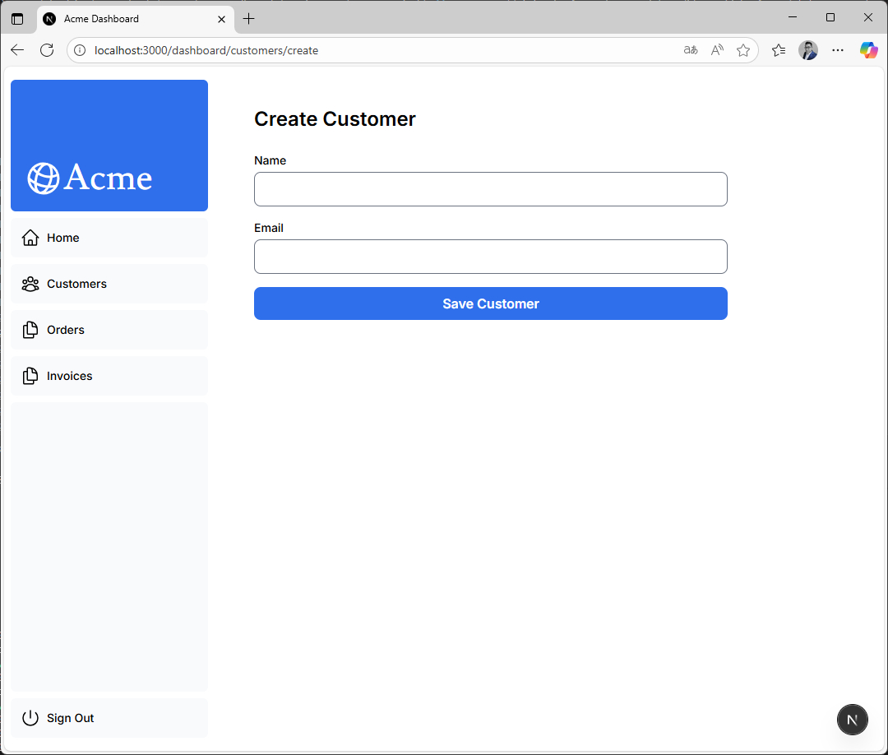
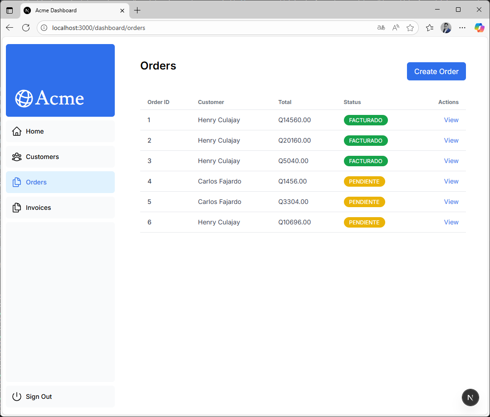
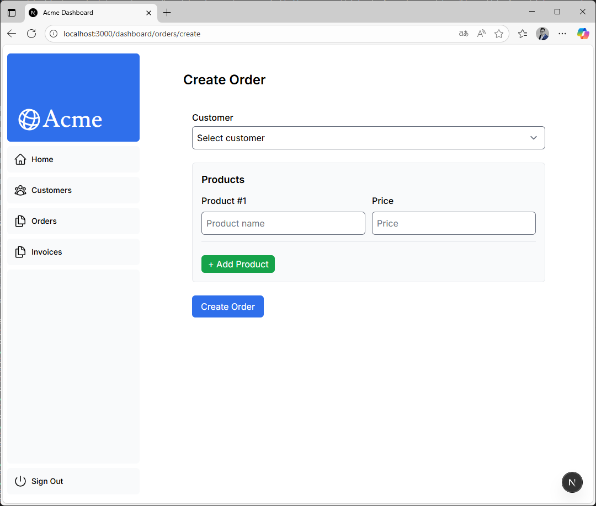
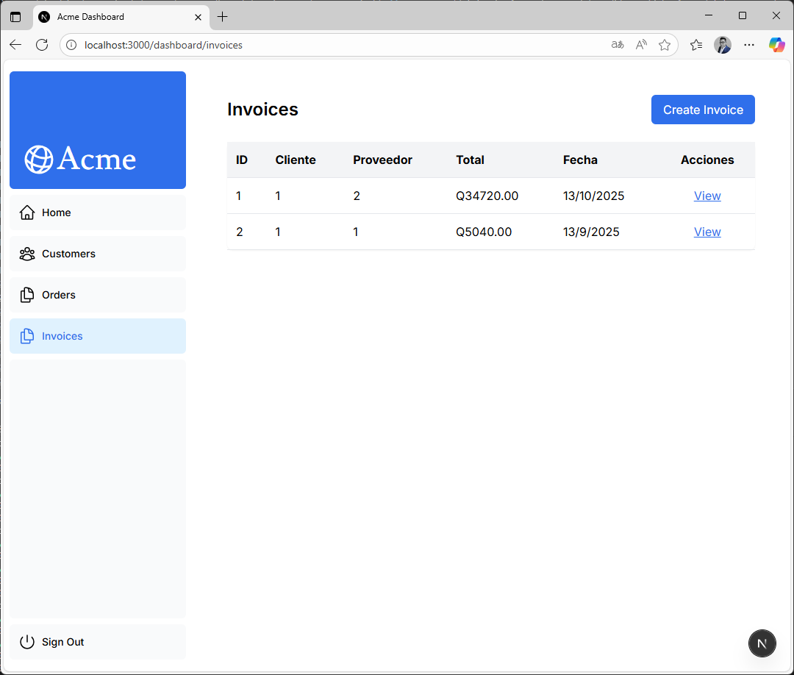
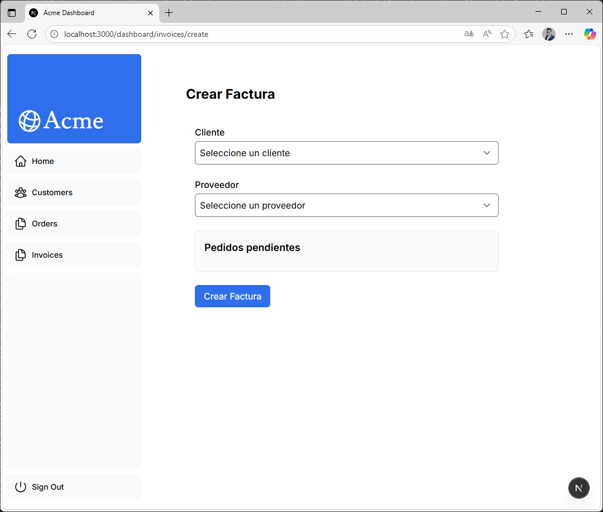

# Plataforma de Control de Pedidos Multiplataforma

Diseñar e implementar una solución completa con **arquitectura distribuida**, integrando:

- Un **frontend web** en **Next.js** (tutorial oficial de [Next.org](http://next.org/)).
- Dos **microservicios Spring Boot** independientes con persistencia en **bases de datos distintas**.
- Un **proyecto Maven reutilizable** que funcione como **dependencia común** para ambos microservicios.

El propósito es realizar la comunicación entre componentes, la lógica compartida y la integración de datos en una arquitectura modular.

## Screenshots

## Documentación (Anexo)

[Documentación en Notion](https://www.notion.so/Proyecto-Final-2ac7ab8e91678040b939d04628b304ef?source=copy_link)

## Contexto del Problema

La empresa **MultiPedidos S.A.** administra pedidos de distintos clientes y proveedores en varias regiones.

Por políticas internas y requerimientos técnicos:

- El **módulo de Clientes y Pedidos** opera en una base **Mysql**(infraestructura regional).
- El **módulo de Proveedores y Facturación** opera en una base **PostgreSQL** (infraestructura corporativa).
- Ambos módulos comparten una **lógica de negocio común** (cálculos) implementada en una **librería Maven compartida**.

El **Dashboard en Next.js** es el panel administrativo que muestre información combinada proveniente de ambos servicios.

## Tecnologías

**Next.js** + **Spring Boot** + **Maven** + **Mysql**+ **PostgreSQL**

